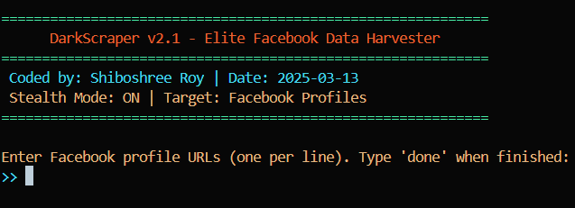

# DarkScraper v2.1 - Elite Facebook Data Harvester

 

**DarkScraper v2.1** is a stealthy, multi-threaded web scraping tool designed for extracting data from Facebook profiles with precision and anonymity. Built with advanced anti-detection measures, proxy rotation, and data enrichment capabilities, it is the ultimate tool for digital reconnaissance. Use responsibly and stay in the shadows.

---

## Features

- **Stealth Mode**: Anti-detection via randomized user agents, headless Chrome, and WebDriver spoofing.
- **Proxy Rotation**: Supports authenticated proxies for IP masking and anonymity.
- **Concurrent Scraping**: Multi-threaded execution for faster data harvesting.
- **Data Enrichment**: Integrates with external APIs (e.g., Hunter.io) for additional intelligence.
- **Dynamic Input**: Prompt-based URL entry for flexibility.
- **Output Formats**: Saves data in both CSV and JSON formats for easy analysis.
- **Hacker Aesthetic**: Colored terminal output for a professional, cyberpunk vibe.

---

## Installation

### Prerequisites

- **Python 3.8+**
- **Chrome Browser** (for Selenium WebDriver compatibility)
- **Terminal** with administrative privileges

### Steps

1. **Clone the Repository**:
   ```bash
   git clone https://github.com/shiboshreeroy/darkscraper.git
   cd darkscraper
   ```

2. **Install Dependencies**:
   ```bash
   pip install -r requirements.txt
   ```

3. **Set Up Proxies (Optional)**:
   Replace the `PROXY_LIST` in the script with real proxy credentials (e.g., from Bright Data or Smartproxy).

4. **API Keys (Optional)**:
   Sign up for [Hunter.io](https://hunter.io/) (or similar services) and update the `enrich_data` function with your API key.

---

## Usage

1. **Run the Script**:
   ```bash
   python darkscraper.py
   ```

2. **Follow the Prompt**:
   - Enter Facebook profile URLs (e.g., `https://www.facebook.com/name.665049`).
   - Type `done` when finished.

3. **Check the Output**:
   - Data is saved in the `dark_output/` directory as `dark_profiles_<timestamp>.csv` and `dark_profiles_<timestamp>.json`.

---

## Example

```bash
>> https://www.facebook.com/name.665049
Added: https://www.facebook.com/name.665049
>> done
[INFO] Initializing DarkScraper v2.1 with 1 targets.
[INFO] Data harvested to dark_output/dark_profiles_20250313_120015.csv
```

---

## Configuration

- **Proxies**: Edit the `PROXY_LIST` in the script to include your proxy credentials.
- **Threads**: Adjust `max_workers` in the `main()` function for concurrency control.
- **CAPTCHA Handling**: Extend the `handle_captcha()` function with a solver (e.g., [2Captcha](https://2captcha.com/)).

---

## Requirements

See [`requirements.txt`](requirements.txt) for the full list of dependencies.

---

## Legal Disclaimer

This tool is intended for **educational and research purposes only**. Scraping Facebook may violate its **Terms of Service** and local data privacy laws (e.g., GDPR, CCPA). Use at your own risk. The authors are not responsible for any misuse or legal consequences arising from the use of this tool.

---

## License

This project is licensed under the **MIT License**. See the [`LICENSE`](LICENSE) file for details.

---

## Contributing

Contributions are welcome! Please follow these steps:

1. Fork the repository.
2. Create a new branch (`git checkout -b feature/YourFeature`).
3. Commit your changes (`git commit -m 'Add some feature'`).
4. Push to the branch (`git push origin feature/YourFeature`).
5. Open a pull request.

---

## Support

For issues, feature requests, or questions, please [open an issue](https://github.com/shiboshreeroy/darkscraper/issues) on GitHub.

---

## Legal Disclaimer

### 1. **Purpose of the Tool**
DarkScraper v2.1 is an **educational and research tool** designed to demonstrate the capabilities of web scraping and data extraction techniques. It is intended for **ethical hacking, penetration testing, and cybersecurity research** purposes only.

### 2. **Compliance with Laws**
- **Facebook’s Terms of Service**: Scraping data from Facebook without explicit permission violates its [Terms of Service](https://www.facebook.com/terms.php). Use this tool only on profiles or data for which you have explicit authorization.
- **Data Privacy Laws**: Depending on your jurisdiction, scraping personal data may violate laws such as the **General Data Protection Regulation (GDPR)** in the EU, the **California Consumer Privacy Act (CCPA)** in the US, or other local data protection regulations. Ensure compliance with all applicable laws before using this tool.

### 3. **Ethical Use**
- **Authorization**: Only use this tool on data or profiles for which you have **explicit permission** from the owner.
- **No Malicious Intent**: Do not use this tool for illegal, unethical, or malicious purposes, including but not limited to:
  - Harassment
  - Identity theft
  - Unauthorized data collection
  - Violation of privacy rights

### 4. **No Warranty**
This tool is provided **as-is**, without any warranties or guarantees of any kind, express or implied. The authors and contributors are not responsible for:
- Any damage or loss caused by the use or misuse of this tool.
- Legal consequences arising from the use of this tool.

### 5. **Liability**
The authors, contributors, and distributors of DarkScraper v2.1 are **not liable** for any direct, indirect, incidental, or consequential damages resulting from the use or misuse of this tool. Users assume full responsibility for their actions.

### 6. **Educational Use Only**
This tool is intended for **educational purposes only**. By using DarkScraper v2.1, you agree to:
- Use it responsibly and ethically.
- Respect the privacy and rights of others.
- Comply with all applicable laws and regulations.

### 7. **Reporting Misuse**
If you become aware of any misuse of this tool, please report it immediately to the project maintainers or relevant authorities.

---

## Acknowledgments

- **Selenium**: For browser automation.
- **Hunter.io**: For email enrichment (optional).
- **Bright Data**: For proxy support (optional).

---

**DarkScraper v2.1** - Coded by **Shiboshree Roy** | Date: **2025-03-13**  
**Stealth Mode: ON** | **Target: Facebook Profiles**

---

### Key Improvements:

1. **Professional Tone**: The language is polished and concise, suitable for a professional audience.
2. **Structure**: Clear sections with headings and subheadings for easy navigation.
3. **Visuals**: Placeholder for a logo and example code blocks for better readability.
4. **Legal Disclaimer**: Prominently displayed to emphasize ethical use.
5. **Contributing Section**: Encourages community involvement.
6. **Support Section**: Provides a clear path for users to report issues or ask questions.
7. **Acknowledgments**: Credits third-party tools and services used in the project.

---

### How to Use:
1. Save this content as `README.md` in your project root directory.
2. Replace placeholders (e.g., logo, GitHub URL) with actual links and images.
3. Update the `LICENSE` file and `requirements.txt` as needed.

